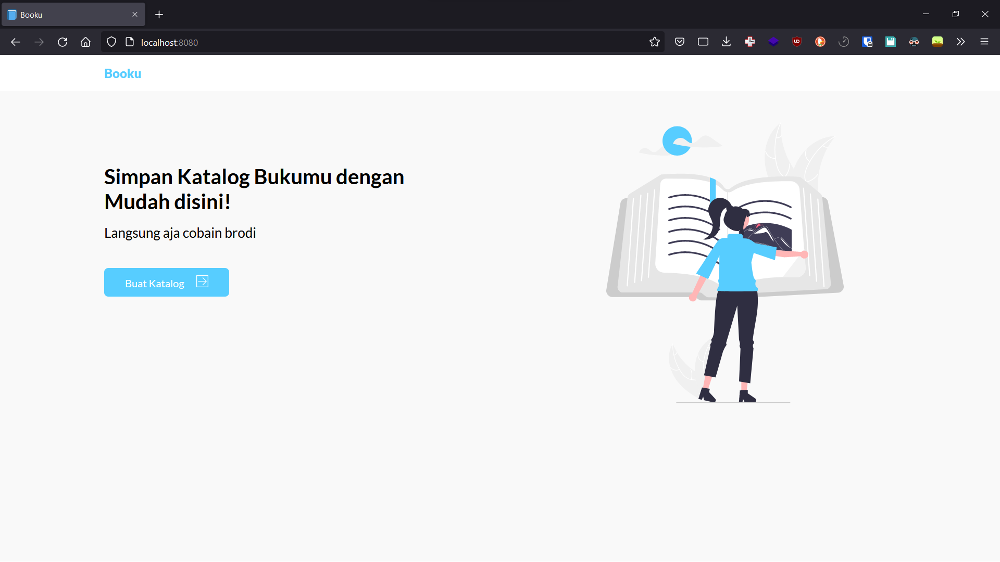

## Screenshot

## Tech Stack

1. HTML as Markup language
2. Sass as CSS preprocessor
3. Express JS as server engine
4. MongoDB as database
5. Eta as templating engine

## How to use

1. Make sure [MongoDB](https://www.mongodb.com/) is installed and running
2. Run `npm install` to install dependencies
3. Run `npm run start-dev` to start the app in development mode

## Repository

1. [Booku](https://github.com/mufidu/booku)
2. [Booku-Frontend](https://github.com/raflisusanto/Booku-Frontend)

## Contributors

1. [Muhammad Mufid Utomo](https://github.com/mufidu)
2. [Muhammad Rafli Susanto](https://github.com/raflisusanto)
3. [Luthfi Novra](https://github.com/luthfinovra)

## API Documentation

[API Documentation](https://documenter.getpostman.com/view/20639724/UyrAEwXR)

## Video (Explanation and Demo)
https://drive.google.com/file/d/1tr6HX6XjJn-LUMFbgPES452O5SFshlUJ/view?usp=sharing

## Live Demo (Optional)

https://booku.mufidu.com/
